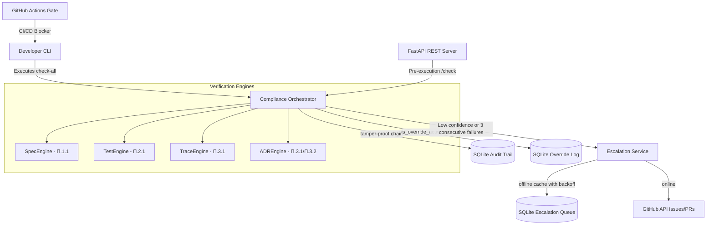

# ADE Compliance Framework

An agentic-first, production-grade compliance gateway ensuring absolute adherence to **Axiom-Driven Engineering (ADE)** principles throughout the software development lifecycle.

---

## 🏛️ Architectural Overview

The ADE Compliance Framework acts as an automated verification barrier that prevents non-compliant code, specifications, or architectures from reaching staging and production.



### Core Concepts

- **TAMPER-PROOF AUDIT LOG**: Every compliance run, individual finding, and attest decision is logged in an append-only SQLite log with cryptographic SHA-256 hash chains (`audit_log` table), ensuring complete immutability.
- **IMMUTABLE OVERRIDES**: Authorized Human Architects (SSO-authenticated) can register targeted exception bypasses (`GET/POST /overrides`) across `FILE`, `DIRECTORY`, or `COMPONENT` scopes. Bypasses support mandatory rationales ($\geq 20$ characters), default 90-day auto-reversion, and permanent justification gates.
- **FAIL-CLOSED RESILIENCY**: Local queues capture GitHub escalation notifications when offline. The engine retries up to 5 times (15-min backoff) before entering a *fail-closed* state, blocking subsequent agent work to prevent compliance gaps.

---

## 🔍 Axiom Verification Matrix

| Postulate | Target Principle | Enforcement Action |
| :--- | :--- | :--- |
| **Π.1.1** | Specification existence | Verifies that a specification file (`spec.md` or under `specs/`) exists. |
| **Π.2.1** | Test-first alignment | Verifies that corresponding test files exist for all staging source modules. |
| **Π.3.1** | Traceability markers | Extracts AST markers (`implements:`, `traces_to:`) across Python, JS, TS, and Java comments. |
| **Π.3.1 (ADR)**| Architectural change gates | Enforces that any dependency/config updates or framework structural model changes have a corresponding ADR. |
| **Π.3.2** | ADR Formats | Invokes `pyadr check-adr-repo` validator to enforce correct naming and status syntax. |
| **Π.5.3** | Consecutive failures | Tracks repeated agent failures, escalating to a Human Architect on 3 consecutive compliance run failures. |

---

## 🚀 Quickstart Guide

### 1. Installation

Ensure Python $\geq 3.11$ is installed. Bootstrap the virtual environment and install all dependencies:

```powershell
uv venv
uv pip install -e ".[dev]"
```

### 2. Manual CLI Verification (`ade-compliance`)

Developers can run checks locally before pushing changes:

```powershell
# Run all compliance engines concurrently on specified directories
ade-compliance check-all src/

# Run specification-only checks
ade-compliance check-spec src/

# Run test-only checks
ade-compliance check-test src/

# Run traceability checks and display matrix
ade-compliance check-traceability src/

# Generate complete machine-readable compliance report
ade-compliance generate-report src/
```

### 3. SSO Architect Overrides

Register exception bypasses directly from the command line:

```powershell
ade-compliance override Π.1.1 \
  --scope-value "src/legacy/" \
  --scope-type "DIRECTORY" \
  --rationale "Legacy codebase migration; exceptions validated by architect." \
  --created-by "architect-01" \
  --expires-in-days 30
```

### 4. Running the FastAPI HTTP Server

Start the API server on `127.0.0.1:8080`:

```powershell
ade-compliance serve --port 8080
```

#### API Swagger Documentation:
- `GET /health`: Health liveness probe.
- `POST /check`: Endpoint for agents to perform pre-execution self-checks.
- `POST /attest`: Endpoint for agents to submit final task attestation (escalates if confidence $< 0.7$).
- `GET /reports/trend`: Aggregates compliance statistics over a 30-day window.
- `GET/POST /overrides`: Protected endpoints (requires `X-SSO-User` header validation) to manage bypasses.
- `GET /metrics`: Serves Prometheus-compatible counters and latency percentiles.

---

## 🔒 Security Hardening (SSO Authentication)

Administrative and critical operations (like override management) require Human Architect single sign-on (SSO) validation.

1. **Header Validation**: All REST calls to `/overrides` endpoints must pass the `X-SSO-User` header.
2. **Architect Integrity Check**: The `CreateOverrideRequest.created_by` field must exactly match the authenticated `X-SSO-User` header, or the API will return a `403 Forbidden` response.

---

## 🧪 Running the Test Suite

Execute the comprehensive test suite to run all 85+ unit and integration test assertions:

```powershell
uv run pytest
```
