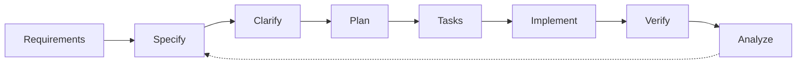

# ADE Methodology

**The Executable Lifecycle of Axiom Driven Engineering**

---

## Overview

The ADE methodology transforms axioms into working software through a structured lifecycle. Each phase produces artifacts that trace back to governing principles.



---

## Phase 1: Specify

**Goal**: Define WHAT and WHY  
**Governing Postulate**: Π.1.1, Π.1.2

### Inputs
- User requirements or problem statement
- Domain constraints
- Stakeholder feedback

### Process
0. **Verify Axiom Acceptance** — Ensure both Human and AI participants have accepted the core axioms
1. Write user stories with acceptance criteria
2. Define functional requirements
3. Identify non-functional constraints
4. Document assumptions and risks

### Outputs
- `.specify/specs/{feature}/spec.md`

### Spec.md Template
```markdown
# {Feature Name} Specification

## User Stories
### [US-1] {Story Title}
**As a** {role}
**I want** {capability}
**So that** {benefit}

#### Acceptance Criteria
- [ ] Given {context}, When {action}, Then {outcome}

## Functional Requirements
- [FR-1] {Requirement}

## Non-Functional Requirements
- [NFR-1] {Requirement}

## Assumptions
- {Assumption}

## Risks
- {Risk}
```

---

## Phase 2: Clarify

**Goal**: Resolve ambiguities  
**Governing Postulate**: Π.1.1a (requirements documented)

### Process
1. Review specification with stakeholders
2. Identify unclear requirements
3. Ask clarifying questions
4. Update specification with answers
5. Repeat until spec is unambiguous

### Three-Cycle Rule
ADE mandates a minimum of 3 clarification cycles:

| Cycle | Focus                               |
| ----- | ----------------------------------- |
| 1     | Terminology and scope               |
| 2     | Edge cases and error handling       |
| 3     | Integration points and dependencies |

---

## Phase 3: Plan

**Goal**: Define HOW  
**Governing Postulate**: Π.3.1, Π.4.1

### Inputs
- Clarified specification
- Project constitution
- Existing architecture

### Process
1. Select technology choices
2. Design component architecture
3. Define API contracts
4. Create ADRs for significant decisions
5. Constitutional compliance check

### Outputs
- `.specify/specs/{feature}/plan.md`
- `docs/adr/XXXX-{decision}.md` (as needed)

### Plan.md Template
```markdown
# {Feature Name} Implementation Plan

## Overview
{Brief description of technical approach}

## Technology Choices
| Component   | Choice | Justification | ADR      |
| ----------- | ------ | ------------- | -------- |
| {Component} | {Tech} | {Why}         | ADR-XXXX |

## Architecture
{Component diagram or description}

## API Contracts
### {Endpoint/Interface}
- Method: {GET/POST/etc}
- Path: {/path}
- Request: {schema}
- Response: {schema}

## Constitutional Compliance
- [ ] Π.2.1: Test strategy defined
- [ ] Π.4.1: Single responsibility per component
- [ ] Π.4.1a: No circular dependencies
```

---

## Phase 4: Tasks

**Goal**: Define WHEN and WHERE  
**Governing Postulate**: Π.1.2a, Π.4.1

### Process
1. Decompose plan into atomic tasks
2. Identify dependencies
3. Order by: Infrastructure → Models → Services → Endpoints → UI
4. Mark parallelizable tasks
5. Estimate effort

### Task Notation
```
[P] — Parallelizable with previous [P] task
[Bx] — Blocked by task x
[USx] — Implements User Story x
```

### Outputs
- `.specify/specs/{feature}/tasks.md`

### Tasks.md Template
```markdown
# {Feature Name} Task Breakdown

## Phase 1: Setup
- [ ] 1. {Task} `[P]`
- [ ] 2. {Task} `[P]`

## Phase 2: Foundation
- [ ] 3. {Task} `[B1,B2]`
- [ ] 4. {Task} `[US-1]`

## Phase 3: Implementation
- [ ] 5. {Task} `[US-1]`
- [ ] 6. {Task} `[US-2]` `[P]`

## Phase 4: Polish
- [ ] 7. {Task} `[B5,B6]`
```

---

## Phase 5: Implement

**Goal**: Execute the plan  
**Governing Postulate**: Π.2.1, Π.2.2

### Red-Green-Refactor Pattern

Every feature implementation follows:

```
1. RED Commit
   - Write failing test(s)
   - Commit: "test: add failing tests for {feature}"
   
2. GREEN Commit  
   - Write minimal implementation to pass
   - Commit: "feat: implement {feature}"
   
3. REFACTOR Commit (optional)
   - Improve code without changing behavior
   - Commit: "refactor: clean up {feature}"
```

### Commit Message Format
```
type(scope): description

[optional body]

Refs: spec/{feature}/spec.md
Postulate: Π.X.Y
```

### Types
- `feat` — New feature
- `fix` — Bug fix
- `test` — Adding tests
- `refactor` — Non-behavioral change
- `docs` — Documentation
- `chore` — Maintenance

---

## Phase 6: Verify

**Goal**: Confirm implementation matches specification  
**Governing Postulate**: Π.2.1, Π.5.1b

### Verification Checklist
- [ ] All acceptance criteria pass
- [ ] Test coverage meets thresholds
- [ ] No regressions in existing tests
- [ ] UI matches design (screenshot artifacts)
- [ ] Performance within bounds
- [ ] Security scan passes

### AI Verification
For AI-assisted implementation:
- [ ] Agent produced verification artifacts
- [ ] Human reviewed critical paths
- [ ] Spec traceability confirmed

---

## Phase 7: Analyze

**Goal**: Learn and improve  
**Governing Postulate**: Π.3.1

### Post-Implementation Review
1. What went well?
2. What could improve?
3. Were estimates accurate?
4. Should any postulates be refined?

### Outputs
- Updated knowledge base
- Process improvement suggestions
- New ADRs if lessons warrant architectural change

---

## Quick Reference

| Phase     | Question      | Output         | Key Postulate |
| --------- | ------------- | -------------- | ------------- |
| Specify   | What & Why?   | spec.md        | Π.1.1         |
| Clarify   | Ambiguous?    | Updated spec   | Π.1.1a        |
| Plan      | How?          | plan.md + ADRs | Π.3.1         |
| Tasks     | When & Where? | tasks.md       | Π.1.2a        |
| Implement | Build it      | Code + Tests   | Π.2.1, Π.2.2  |
| Verify    | Does it work? | Evidence       | Π.5.1b        |
| Analyze   | What learned? | Knowledge      | Π.3.1         |

---

**Version**: 1.0.0 | **Established**: 2026-02-06
