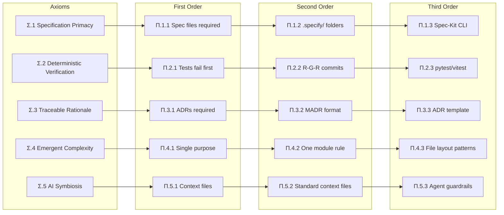

# ADE Postulates

**Logical Derivations from the Core Axioms**

---

## What is a Postulate?

A postulate is a statement derived logically from one or more axioms. In ADE, postulates bridge the gap between abstract truths and concrete practices. They are organized into **three orders** of increasing specificity.

Postulates are denoted with the Greek letter **Pi (Π)** followed by an axiom reference and order number.

```
Π.{Axiom}.{Order}
Example: Π.1.2 = Second-order postulate derived from Axiom 1
```

---

## First-Order Postulates

*Direct derivations from axioms — the immediate logical consequences.*

### From Σ.1 (Specification Primacy)

| ID         | Postulate                                             | Derivation                                                                      |
| ---------- | ----------------------------------------------------- | ------------------------------------------------------------------------------- |
| **Π.1.1**  | No implementation without a specification file        | If code exists to satisfy specs (Σ.1), then code without specs has no purpose   |
| **Π.1.1a** | Requirements must be documented before specifications | Specs satisfy requirements (Σ.1); undocumented requirements cannot be satisfied |
| **Π.1.1b** | Specifications must be machine-parseable              | Automated verification requires structured input                                |
| **Π.1.1c** | Scenarios before Tests                                | No test is defined until a corresponding User Scenario is committed (BDD flow)  |

### From Σ.2 (Deterministic Verification)

| ID         | Postulate                                           | Derivation                                                                |
| ---------- | --------------------------------------------------- | ------------------------------------------------------------------------- |
| **Π.2.1**  | Tests MUST fail before implementation passes        | Determinism requires the Red-Green transition as proof of behavior change |
| **Π.2.1a** | Test environments must be isolated and reproducible | Non-isolated environments introduce non-determinism                       |
| **Π.2.1b** | Async operations must be awaitable with timeouts    | Unbounded async breaks deterministic verification                         |
| **Π.2.1c** | Tests before Code                                   | No code is written until a failing test is written (TDD mandate)          |

### From Σ.3 (Traceable Rationale)

| ID         | Postulate                                   | Derivation                                                           |
| ---------- | ------------------------------------------- | -------------------------------------------------------------------- |
| **Π.3.1**  | ADRs required for all architectural changes | If every decision traces to axioms (Σ.3), the trace must be recorded |
| **Π.3.1a** | Code comments explain "why," never "what"   | "What" is in the code; rationale requires "why"                      |
| **Π.3.1b** | PRs must reference governing specifications | Without references, changes are untraceable                          |

### From Σ.4 (Emergent Complexity)

| ID         | Postulate                                      | Derivation                                                |
| ---------- | ---------------------------------------------- | --------------------------------------------------------- |
| **Π.4.1**  | Components must have single, explicit purposes | Simple components require singular focus                  |
| **Π.4.1a** | Dependencies flow in one direction             | Bidirectional dependencies create non-emergent complexity |
| **Π.4.1b** | Interfaces must be minimal                     | Minimal interfaces maximize composability                 |

### From Σ.5 (AI Symbiosis)

| ID         | Postulate                                        | Derivation                                |
| ---------- | ------------------------------------------------ | ----------------------------------------- |
| **Π.5.1**  | AI agents must have explicit context files       | Symbiosis requires shared understanding   |
| **Π.5.1a** | Agents operate within constitutional constraints | Unconstrained agents violate human intent |
| **Π.5.1b** | Verification confirms AI output matches intent   | Trust requires verification               |

---

## Second-Order Postulates

*Practical applications of first-order postulates — how we implement the rules.*

| ID         | Postulate                                                            | Derived From                        |
| ---------- | -------------------------------------------------------------------- | ----------------------------------- |
| **Π.1.2**  | Use `.specify/` folders for all feature specs                        | Π.1.1 (spec files exist)            |
| **Π.1.2a** | Spec format: `spec.md`, `plan.md`, `tasks.md`                        | Π.1.1b (machine-parseable)          |
| **Π.1.2b** | Scenarios must use Given/When/Then syntax                            | Π.1.1c (Scenarios before Tests)     |
| **Π.2.2**  | Red-Green-Refactor commit pattern mandatory                          | Π.2.1 (tests fail first)            |
| **Π.2.2a** | Minimum 3 commits per scenario: RED + GREEN + REFACTOR               | Π.2.1c (Tests before Code)          |
| **Π.3.2**  | MADR format for all ADRs                                             | Π.3.1 (ADRs required)               |
| **Π.3.2a** | ADRs include "Governing Postulate" field                             | Π.3.1 (trace to axioms)             |
| **Π.4.2**  | One module = one responsibility                                      | Π.4.1 (single purpose)              |
| **Π.4.2a** | No circular imports                                                  | Π.4.1a (unidirectional deps)        |
| **Π.5.2**  | Context files: `.gemini.md`, `.claude.md`, `copilot-instructions.md` | Π.5.1 (explicit context)            |
| **Π.5.2a** | Constitution files define agent boundaries                           | Π.5.1a (constitutional constraints) |

---

## Third-Order Postulates

*Implementation patterns — the specific tools and workflows we use.*

| ID         | Postulate                                                    | Derived From                   |
| ---------- | ------------------------------------------------------------ | ------------------------------ |
| **Π.1.3**  | Spec-Kit CLI workflow for specification creation             | Π.1.2 (`.specify/` folders)    |
| **Π.1.3a** | Commands: `specify`, `clarify`, `plan`, `tasks`, `implement` | Π.1.2a (standard format)       |
| **Π.2.3**  | pytest/vitest with strict timeout enforcement                | Π.2.2 (deterministic tests)    |
| **Π.2.3a** | 60-second maximum for unit test suites                       | Π.2.1 (determinism)            |
| **Π.3.3**  | ADR template includes traceability section                   | Π.3.2a (governing postulate)   |
| **Π.3.3a** | ADR IDs: `0001-short-title.md` format                        | Π.3.2 (MADR format)            |
| **Π.4.3**  | Python: one class per file for core models                   | Π.4.2 (one responsibility)     |
| **Π.4.3a** | TypeScript: barrel exports for clean interfaces              | Π.4.2a (no circular imports)   |
| **Π.5.3**  | Agents must try 3 strategies before escalating               | Π.5.1a (constrained operation) |
| **Π.5.3a** | Browser agents for UI verification                           | Π.5.1b (verification)          |

---

## Postulate Traceability Matrix



---

## Extending Postulates

Projects MAY define domain-specific postulates that derive from core postulates:

```
Π.GAME.2.1 — From Π.2.1: "Dice rolls use seeded CSPRNG for replay"
Π.FIN.4.2  — From Π.4.2: "Financial models isolated from display logic"
```

Domain postulates:
- Must reference a parent postulate
- Cannot contradict any core postulate
- Should be documented in the project's `.specify/memory/constitution.md`

---

**Version**: 1.0.0 | **Established**: 2026-02-06
